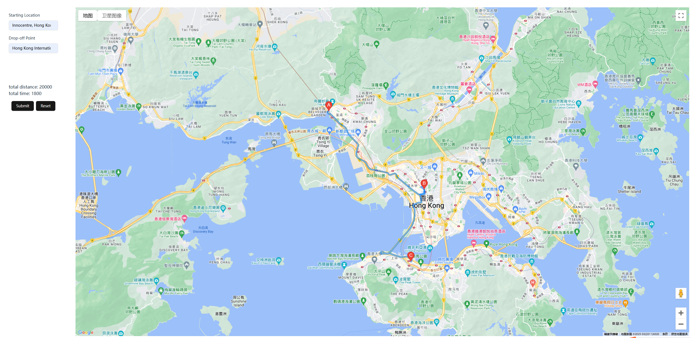
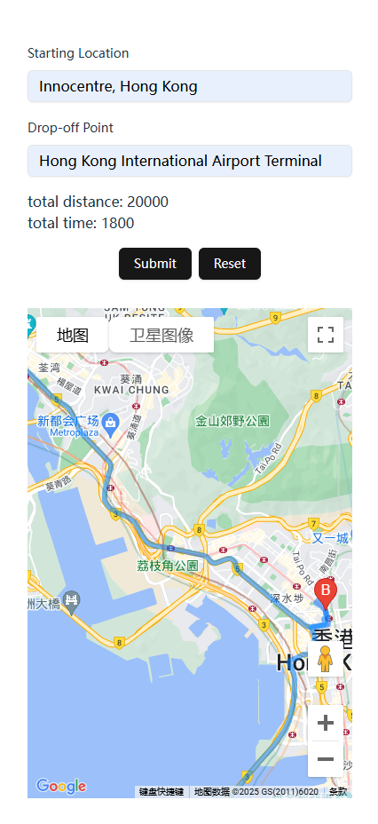

# Frontend Task

## Introduction

A simple frontend application that allows users to input an origin and destination and get a planned route. This app displays an actual driving route with planned waypoints. The UI is responsive on mobile and desktop.

Try it out [here](https://llm-chlg-valkureyips-projects.vercel.app/)

on desktop:



on mobile:



## Prerequisites

- This app uses Google Maps Services and requires a [Google Maps API Key](https://developers.google.com/maps/documentation/javascript/get-api-key)

## Setup and run
Install dependencies
```bash
npm install
```
Create a `.env` file in the root directory and add the environment variables (see `.env.example` for reference)
```bash
VITE_GOOGLE_MAPS_API_KEY = your_api_key_here # google maps api key
VITE_USE_MOCK = false # true to use mock api
VITE_API_URL = your_api_url_here # only used if VITE_USE_MOCK is false
VITE_API_MOCK_URL = your_mock_api_url_here # only used if VITE_USE_MOCK is true
```

Run the development server
```bash
npm run dev
```

## Testing

This app uses [Vitest](https://vitest.dev/guide/) and [React Testing Library](https://testing-library.com/docs/react-testing-library/intro/) for testing.

Run tests
```bash
npm run test
```

## Create a production build
```bash
npm run build
```

## Deployment

This app is deployed on Vercel ([see here](https://llm-chlg-valkureyips-projects.vercel.app/))

Remember to set the environment variables in your production environment.

## Technologies

- [React + TypeScript + Vite](https://vite.dev/guide/)
- [Shadcn/UI + TailwindCSS](https://ui.shadcn.com/docs/installation/vite)
- [Vitest](https://vitest.dev/guide/)
- [React Testing Library](https://testing-library.com/docs/react-testing-library/intro/)
